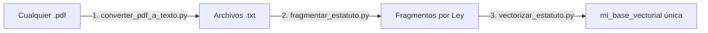

# Guía de Actualización del RAG para el Agente Laboral 📖

¡Bienvenido! Esta guía te enseñará paso a paso cómo actualizar la base de conocimientos vectorial del **Agente Laboral** con múltiples leyes y convenios. Está diseñada para ser rápida de leer y fácil de entender por desarrolladores junior.

---

## 🚀 Flujo de Trabajo (Pipeline Dinámico)

Para alimentar la base de datos de nuestro agente de forma colectiva con varias leyes, el sistema ejecuta tres pasos consecutivos en cadena:



> [!TIP]
> **¡El pipeline está automatizado!** Al ejecutar el primer script, este procesará todos los PDFs de la carpeta y llamará a los siguientes scripts automáticamente. ¡Un solo comando se encarga de todo!

---

## 🛠️ Requisitos Previos

Antes de arrancar, asegúrate de cumplir con lo siguiente en tu terminal:

1. **Credenciales de Google Cloud (GCP) activas:**
   Asegúrate de haber iniciado sesión para poder usar Vertex AI:
   ```bash
   gcloud auth application-default login
   ```
2. **Dependencias instaladas:**
   Los scripts requieren herramientas como `pymupdf` (para leer PDFs) y `chromadb` (para guardar vectores). Se instalan automáticamente mediante `uv`:
   ```bash
   uv sync
   ```

---

## 📁 Archivos en esta carpeta

En esta sección te describimos para qué sirve cada componente del directorio:

| Archivo / Carpeta | Función |
| :--- | :--- |
| [converter_pdf_a_texto.py](file:///c:/Users/adri/Desktop/MIA/Proyectos/Recursosagenticos/mcp_agentes/rag_laboral_builder/converter_pdf_a_texto.py) | **Paso 1:** Escanea todos los `.pdf` en la carpeta, extrae el texto, elimina el ruido y los guarda en archivos `.txt` con los mismos nombres originales. Al terminar, arranca el paso 2. |
| [fragmentar_estatuto.py](file:///c:/Users/adri/Desktop/MIA/Proyectos/Recursosagenticos/mcp_agentes/rag_laboral_builder/fragmentar_estatuto.py) | **Paso 2:** Escanea todos los `.txt` generados y los divide en fragmentos (chunks) de 800 caracteres mostrando una muestra de coherencia de cada uno en la consola. Al terminar, arranca el paso 3. |
| [vectorizar_estatuto.py](file:///c:/Users/adri/Desktop/MIA/Proyectos/Recursosagenticos/mcp_agentes/rag_laboral_builder/vectorizar_estatuto.py) | **Paso 3:** Lee todos los `.txt`, los fragmenta, les añade metadatos de origen (ej: `source: ET.txt`), recrea de forma limpia la base de datos Chroma DB y vectoriza los fragmentos a través de Vertex AI en lotes de 40. |
| [mi_base_vectorial/](file:///c:/Users/adri/Desktop/MIA/Proyectos/Recursosagenticos/mcp_agentes/rag_laboral_builder/mi_base_vectorial) | **Base de Datos vectorial única y unificada** que contiene el conocimiento de todas tus leyes integradas. |

---

## 🏃‍♂️ Cómo Actualizar el RAG Paso a Paso

Sigue estas sencillas instrucciones cuando quieras añadir nuevas leyes, convenios o estatutos:

### Paso 1: Añade tus archivos PDF
Coloca cualquier PDF legal (por ejemplo: `convenio_metal.pdf`, `estatuto_autonomos.pdf`, `ET.pdf`) en esta misma carpeta.

### Paso 2: Ejecuta la tubería
Abre tu consola en la raíz del proyecto (`Recursosagenticos/`) y ejecuta el comando:
```powershell
uv run python mcp_agentes/rag_laboral_builder/converter_pdf_a_texto.py
```

### Paso 3: Verifica la salida en consola
Verás cómo el script procesa cada documento y los indexa todos en la base de datos común de forma acumulativa:
```text
Se encontraron 2 archivos PDF en la carpeta.
Procesando: ET.pdf ...
 -> ¡Éxito! Archivo de texto creado en: ET.txt
Procesando: convenio.pdf ...
 -> ¡Éxito! Archivo de texto creado en: convenio.txt
¡Proceso de conversión finalizado!

[Encadenamiento] Iniciando fragmentar_estatuto.py...
Se encontraron 2 archivos de texto para fragmentar.
=== Procesando fragmentación de: ET.txt ===
Número total de fragmentos generados: 612
=== Procesando fragmentación de: convenio.txt ===
Número total de fragmentos generados: 120

[Encadenamiento] Iniciando vectorizar_estatuto.py...
Usando proyecto GCP: project3grupo1
Leyendo y fragmentando: ET.txt
 -> Generados 612 fragmentos para ET.txt.
Leyendo y fragmentando: convenio.txt
 -> Generados 120 fragmentos para convenio.txt.

Total acumulado: 732 fragmentos listos para vectorizar.
Conectando con Vertex AI y generando vectores...
Limpiando base de datos vectorial anterior...
Indexando en la base de datos local en: .../mi_base_vectorial...
 -> Procesando lote 1 (fragmentos 0 a 40)...
 ...
¡Éxito! Base de datos vectorial indexada en: .../mi_base_vectorial
```

---

## 💡 Conceptos Clave para Juniors

> [!IMPORTANT]
> **Base de Datos Unificada y Metadatos de Origen**
> Para que el agente pueda responder preguntas de diferentes leyes, almacenamos todos los fragmentos en la **misma base de datos Chroma**. A cada fragmento se le asigna de forma automática un metadato `source` con el nombre del archivo de texto de donde se extrajo. Esto permite que el agente sepa de qué ley proviene cada información al responder.

> [!NOTE]
> **Procesamiento por Lotes (Batching)**
> Vertex AI limita las solicitudes de embeddings a **250 textos** y **20,000 tokens** por llamada. Para evitar que el servidor de Google rechace las solicitudes (error `INVALID_ARGUMENT`), dividimos todos los fragmentos consolidados en lotes de 40 fragmentos y los indexamos de forma secuencial.
